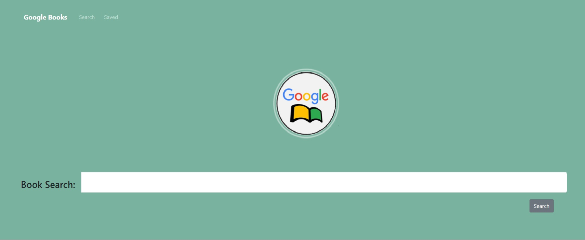

# Google-Books-Search

## Project Description

GoogleBookSearchApp is a React-based Google Books Search app that allows users to search for books via the Google Books API. Users have the option to "Save" a book, saving it to the Mongo database. Users have the option to "View" the book, bringing them to the book on Google Books, or "Delete" a book, removing it from the Mongo database.

## Install and Run the app

* Clone this repo in your terminal with the command git clone or just download it to your computer
* change directory into cd React-employee-directory
* run npm install in your terminal
* run npm start and the app will run locally 

 ## Technologies Used

    * React
    * ES6
    * Express.js
    * Node.js
    * NPM packages: React-router, Express, Axios   
    * Bootstrap
    * CSS
## License 

## Author/s
Beshayr 

 

